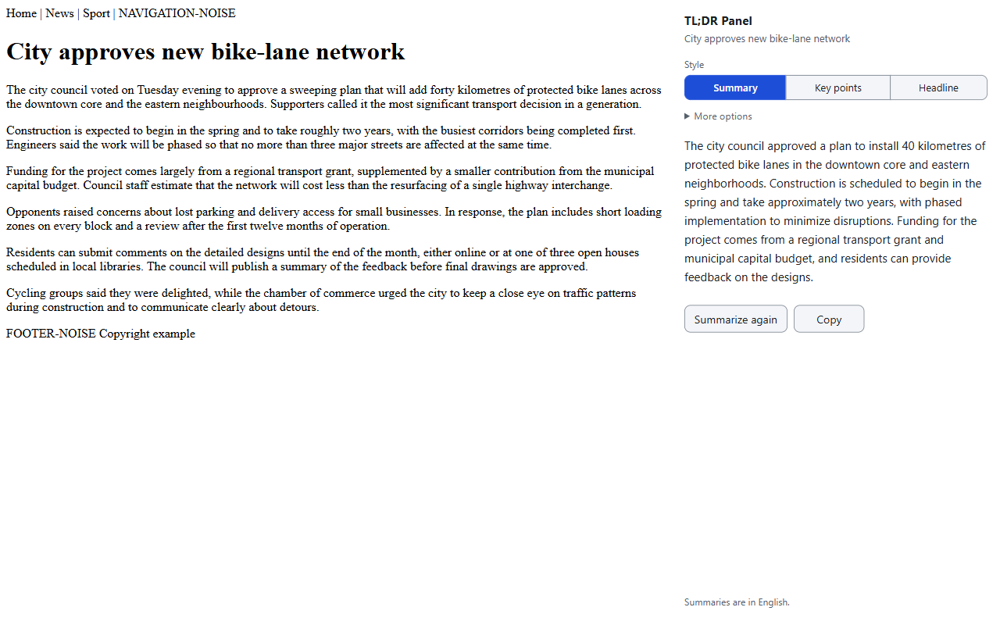

# TL;DR Panel

**Summarize the page you're reading in one click, privately, using Chrome's built-in on-device AI.**
Needs desktop Chrome 138+, and summaries are in English.

TL;DR Panel is a Chrome extension that summarizes the web page you are reading using Chrome's
built-in, on-device Summarizer API (Gemini Nano). No backend, no account, no API key, no
telemetry. Page text never leaves your device.



## Use

1. Open an article or website and click the TL;DR Panel toolbar icon (or press Alt+Shift+S). If you
   don't see the icon, look under Chrome's puzzle-piece menu and pin it.
2. The side panel opens and summarizes that page. With the panel open, click the icon on another
   tab to summarize that tab.
3. Pick a style (Summary, Key points, Headline). Under "More options" choose the detail level
   (Brief, Standard, Detailed).

First use needs a one-time download of Chrome's on-device model (in our test about 7 minutes on
a fast connection; best on Wi-Fi). The panel shows a card with a button and progress bar.

Limits: it reads regular web pages only. It cannot read Chrome's own pages (New Tab, Settings, the
Web Store), PDFs, or local files unless you turn on "Allow access to file URLs" for the extension.
Summaries are English only and are AI output, so they can be wrong.

## Requirements

- Desktop Chrome 138 or newer on Windows 10/11, macOS 13+, Linux, or Chromebook Plus
- At least 22 GB of free disk space
- A GPU with more than 4 GB VRAM, or 16 GB RAM and 4+ CPU cores

## Permissions explained

| Permission | Why |
| --- | --- |
| `sidePanel` | Show the summary in Chrome's side panel. |
| `activeTab` | Read the text of the tab you clicked the icon on, only at that moment. No broad host access. |
| `scripting` | Inject the bundled text extractor into that tab. |
| `storage` | Remember your chosen style and detail level locally. |

There are no host permissions. See [PRIVACY.md](PRIVACY.md).

## Develop

```
npm ci
npm run build       # dist/
npm test            # unit tests
npm run test:e2e    # Playwright
npm run lint
npm run package     # release/tldr-panel-v<version>.zip
npm run icons       # regenerate src/icons/*.png
node scripts/screenshots.mjs   # regenerate docs/screenshots (after build --e2e)
```

Load `dist/` at `chrome://extensions` with Developer mode on. See [CONTRIBUTING.md](CONTRIBUTING.md)
and [DECISIONS.md](DECISIONS.md).

## License

MIT. Third-party notices in [THIRD_PARTY_NOTICES.md](THIRD_PARTY_NOTICES.md).
